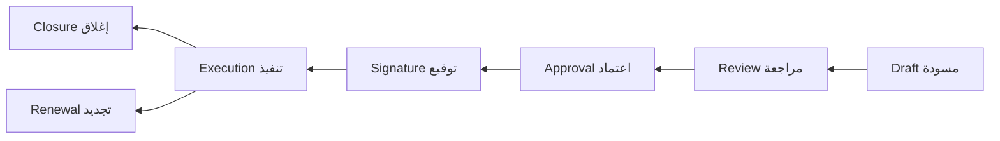
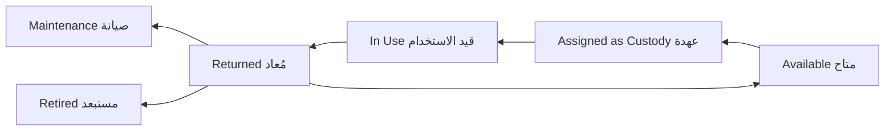

# Core Workflows

> **Status:** Approved (stages fixed; open details marked TBD)
> **Last updated:** 2026-08-06

## Purpose

Document the four core business workflows of the MVP. Every important transition in these workflows must be **audited** and **permission-checked**.

## Workflow 1: Governance chain (سلسلة الحوكمة)

Meeting → Recommendation → Decision → Task(s) → Responsible Person → Execution → Measurement → Closure

اجتماع ← توصية ← قرار ← مهمة/مهام ← الشخص المسؤول ← تنفيذ ← قياس ← إغلاق

### Rules

- A meeting may create one or more decisions.
- A decision may originate from a meeting **or exist independently**.
- A decision may generate one or more tasks.
- Tasks must have responsible users or employees.
- Task progress and status must be measurable.
- Completing one task must **not** automatically close the decision unless all required tasks are completed.
- Every important transition must be audited.

## Workflow 2: Contract lifecycle (دورة حياة العقد)

Contract Draft → Review → Approval → Signature → Execution → Closure or Renewal

مسودة عقد ← مراجعة ← اعتماد ← توقيع ← تنفيذ ← إغلاق أو تجديد

### Rules

- Contract status transitions must be controlled (explicit action endpoints, policy-gated).
- Each transition must record actor, timestamp, and optional comments.
- Attachments must be preserved (**Documents module** — deferred relative to Contracts Sprint 009 API/UI; Contracts must remain attachable later).
- Contract expiry notifications must be supported (**Notifications module** delivers; Contracts emits expiry state + documented hooks).
- Unauthorized users must not review, approve, sign, execute, close, renew, or cancel contracts.

### Sprint 009 locked decisions (see [05-contracts/](../09-modules/05-contracts/))

- Renewal creates a **new** contract record; source becomes `renewed`.
- Return-to-draft allowed from `in_review` with required comment.
- Hard delete only for never-advanced drafts; otherwise cancel/close/expire/renew.
- Numbering: `CTR-######`, tenant sequence, immutable.

## Workflow 3: Asset and custody lifecycle (دورة الأصل والعهدة)

Asset → Available → Assigned as Custody → In Use → Returned → Available / Maintenance / Retired

### Rules

- Custody assignment must record asset, receiver, assignment date, and expected return date when applicable.
- Returning custody must preserve the complete historical record; old custody history must never be overwritten.
- An asset cannot be actively assigned to more than one person at the same time.

## Workflow 4: Inventory transaction (حركة المخزون)

Purchase / Addition → Storage → Transfer / Issue / Return → Updated Balance

### Rules

- Inventory quantities are **calculated from transactions** — never edited directly.
- Manual stock editing must be restricted (adjustment transactions with permission and reason).
- Every transaction must record source, destination, actor, time, and reason.
- Negative stock must be blocked unless explicitly configured later (configuration: TBD).

## TBD

- Role-to-transition mapping for each workflow: defaults TBD (permissions catalog exists in [PERMISSION_MODEL.md](../06-security/PERMISSION_MODEL.md); Contracts suggested grants in [05-contracts/PERMISSIONS.md](../09-modules/05-contracts/PERMISSIONS.md)).
- Rejection/return-to-previous-stage behavior in **decision** flows: TBD. (Contracts: return `in_review` → `draft` locked in Sprint 009 spec.)
- Measurement criteria/KPIs for task execution: TBD.
- Renewal behavior for contracts: **locked** in Sprint 009 (new record + `renewed_from_contract_id`) — see [05-contracts/BUSINESS_RULES.md](../09-modules/05-contracts/BUSINESS_RULES.md).
