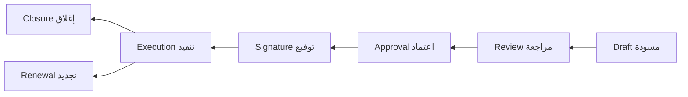
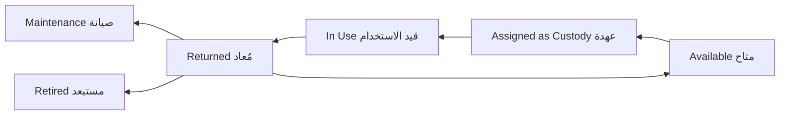

# Core Workflows

> **Status:** Approved (stages fixed; open details marked TBD)
> **Last updated:** 2026-08-10

## Purpose

Document the four core business workflows of the MVP. Every important transition in these workflows must be **audited** and **permission-checked**.

## Workflow 1: Governance chain (سلسلة الحوكمة)

Meeting → Recommendation → Decision → Task(s) → Responsible Person → Execution → Measurement → Closure

اجتماع ← توصية ← قرار ← مهمة/مهام ← الشخص المسؤول ← تنفيذ ← قياس ← إغلاق

### Rules

- A meeting may create one or more decisions (via one or more recommendations).
- A decision may originate from a meeting **or exist independently**.
- A decision may generate one or more tasks.
- Tasks must have responsible users or employees.
- Task progress and status must be measurable.
- Completing one task must **not** automatically close the decision unless all required tasks are completed.
- Every important transition must be audited.

### Sprint 010 locked decisions (see [06-meetings/](../09-modules/06-meetings/))

- Meetings module owns meeting lifecycle, attendees (employees only), structured agenda items, minutes text, and **first-class recommendations** (not Decisions) — [ADR-0007](../10-decisions/ADR-0007-MEETING-AGENDA-AND-RECOMMENDATIONS.md).
- Numbering: `MTG-######`, tenant sequence, immutable.
- Hard delete only for never-advanced drafts; otherwise cancel.

### Sprint 011 locked decisions (see [07-decisions/](../09-modules/07-decisions/) · [ADR-0008](../10-decisions/ADR-0008-DECISION-RECOMMENDATION-AND-APPROVAL.md))

- Decisions own nullable unique `source_recommendation_id` (one final recommendation → at most one Decision); no `decision_id` on recommendations; meeting derived when sourced.
- Standalone Decisions allowed; numbering `DEC-######`.
- Lifecycle: `draft` → `pending_approval` → `approved` → `closed`; early cancel; return-to-draft (no separate rejected/active statuses).
- Single-step approval via `decisions.approve`.

### Sprint 012 locked decisions (see [08-tasks/](../09-modules/08-tasks/) · [ADR-0009](../10-decisions/ADR-0009-TASK-ASSIGNEE-AND-DECISION-GATE.md))

- Tasks own nullable `decision_id`; standalone Tasks allowed; numbering `TSK-######`.
- Single Employee assignee; group/multi-assignee deferred.
- Lifecycle: `draft` → `assigned` → `in_progress` → `completed`; cancel early; overdue derived.
- Measurement: required `completion_notes` on complete + `progress_percent`.
- Decision close gated while open linked Tasks exist (`DECISION_CLOSE_NOT_ALLOWED`); completing Tasks never auto-closes Decision.
- Limited assignee self-service via User↔Employee link.

## Workflow 2: Contract lifecycle (دورة حياة العقد)

Contract Draft → Review → Approval → Signature → Execution → Closure or Renewal

مسودة عقد ← مراجعة ← اعتماد ← توقيع ← تنفيذ ← إغلاق أو تجديد

### Rules

- Contract status transitions must be controlled (explicit action endpoints, policy-gated).
- Each transition must record actor, timestamp, and optional comments.
- Attachments must be preserved (**Documents module** — Sprint 013 specified / ADR-0010; implementation pending; Contracts remain attachable via morph `contract` without changing Contract columns).
- Contract expiry notifications must be supported (**Notifications module** delivers; Contracts emits expiry state + documented hooks).
- Unauthorized users must not review, approve, sign, execute, close, renew, or cancel contracts.

### Sprint 009 locked decisions (see [05-contracts/](../09-modules/05-contracts/))

- Renewal creates a **new** contract record; source becomes `renewed`.
- Return-to-draft allowed from `in_review` with required comment.
- Hard delete only for never-advanced drafts; otherwise cancel/close/expire/renew.
- Numbering: `CTR-######`, tenant sequence, immutable.

## Workflow 3: Asset and custody lifecycle (دورة الأصل والعهدة)

Asset → Available → Assigned as Custody → In Use → Returned → Available / Maintenance / Retired

### Rules

- Custody assignment must record asset, receiver (Employee), assignment date, and expected return date when applicable.
- Returning custody must preserve the complete historical record; old custody history must never be overwritten.
- An asset cannot be actively assigned to more than one person at the same time.

### Sprint 015 locked decisions (see [11-assets-and-custodies/](../09-modules/11-assets-and-custodies/) · [ADR-0012](../10-decisions/ADR-0012-ASSET-CUSTODY-AND-OWNERSHIP.md))

- Assets `AST-######`; custodies `CUS-######`.
- Asset statuses: `available` \| `in_use` \| `maintenance` \| `damaged` \| `retired` \| `lost` (stub **Assigned** dropped — active custody ⇒ `in_use`).
- Append-only `asset_custodies` + `asset_status_transitions`; single active custody under Asset `FOR UPDATE`.
- Current holder SoR = active custody (optional `current_custody_id` cache).
- Optional home/storage `warehouse_id` (not inventory quantity); no `inventory_item_id` / no auto stock post in Sprint 015.
- Damaged/Lost are statuses via explicit actions; liability workflows deferred.
- Custody correction/void deferred.

## Workflow 4: Inventory transaction (حركة المخزون)

Purchase / Addition → Storage → Transfer / Issue / Return → Updated Balance

> **Note (Sprint 014):** “Purchase/Addition” in the diagram means **manual inventory receipt/opening** until Procurement exists. No purchase orders in MVP.

### Rules

- Inventory quantities are **ledger-authored** via append-only movements; cached balances are updated in the same transaction — never edited directly by clients ([ADR-0011](../10-decisions/ADR-0011-INVENTORY-LEDGER-BALANCE-AND-TRANSFER.md)).
- Manual stock editing must be restricted (adjustment transactions with permission and reason).
- Every transaction must record warehouse, item, quantity effect, actor, time, and reason.
- Negative stock must be blocked in MVP (configuration deferred).

### Sprint 014 locked decisions (see [10-warehouses-and-inventory/](../09-modules/10-warehouses-and-inventory/) · [ADR-0011](../10-decisions/ADR-0011-INVENTORY-LEDGER-BALANCE-AND-TRANSFER.md))

- Warehouses `WH-######`; items `ITM-######`; movements `MOV-######`.
- Materialized `inventory_balances` + immutable `inventory_movements`.
- Actions: opening/receipt, issue, return, atomic transfer, adjustment (delta).
- Fixed base UOM per item (`DECIMAL(18,3)`); no conversions.
- Concurrent mutations: `SELECT … FOR UPDATE`; transfer locks by ascending `warehouse_id`.
- Procurement/Assets/Custodies must not write balances directly.

## TBD

- Role-to-transition mapping for each workflow: defaults TBD (permissions catalog exists in [PERMISSION_MODEL.md](../06-security/PERMISSION_MODEL.md); Contracts suggested grants in [05-contracts/PERMISSIONS.md](../09-modules/05-contracts/PERMISSIONS.md)).
- Rejection/return-to-previous-stage behavior in **decision** flows: TBD. (Contracts: return `in_review` → `draft` locked in Sprint 009 spec.)
- Measurement criteria/KPIs for task execution: TBD.
- Renewal behavior for contracts: **locked** in Sprint 009 (new record + `renewed_from_contract_id`) — see [05-contracts/BUSINESS_RULES.md](../09-modules/05-contracts/BUSINESS_RULES.md).
- Negative-stock configuration mechanism: **deferred** (MVP always blocks; ADR-0011).
