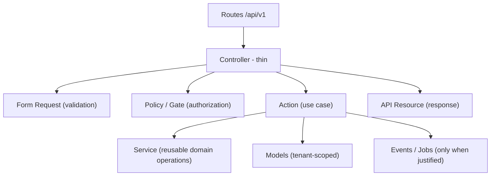

# Architecture

> **Status:** Approved
> **Last updated:** 2026-08-09

## Purpose

Define the overall architecture and the mandatory layering rules for the platform.

Hand-rolled tenant RBAC (Sprint 006 — **implemented**): global `permissions` catalog, tenant-owned `roles`, pivots `user_roles` / `role_permissions` — see [02-users-and-authorization/](../09-modules/02-users-and-authorization/). Do not add Spatie without an ADR.

Tenant-internal hierarchy (Sprint 007 — **specified**): single adjacency-list `organization_units` table — see [03-organization-structure/](../09-modules/03-organization-structure/) and [ADR-0004](../10-decisions/ADR-0004-ORGANIZATION-UNITS-HIERARCHY.md). Not multi-tenancy; not RBAC.

## Style

- **Modular monolith**: one deployable Laravel 12 application organized into a `Core/` layer and business `Modules/`. See [ADR-0002](../10-decisions/ADR-0002-MODULAR-MONOLITH.md) and [BACKEND_STRUCTURE.md](BACKEND_STRUCTURE.md).
- **API-first**: a versioned REST API (`/api/v1`) consumed by the Vue web frontend and reusable by future mobile apps.
- **Monorepo**: backend and frontend in one repository. See [ADR-0001](../10-decisions/ADR-0001-MONOREPO.md).
- **Multi-tenant from day one**: single application, single database, shared schema with `tenant_id`. See [MULTI_TENANCY.md](MULTI_TENANCY.md) and [ADR-0003](../10-decisions/ADR-0003-MULTI-TENANCY.md).

## Backend Layering (mandatory)

| Layer | Responsibility | Rules |
|---|---|---|
| Controller | Wire request to use case | Thin. Receives validated input, calls an Action, returns an API Resource. **No workflows, no large queries, no storage handling, no manual permission logic, no complex response arrays.** |
| Form Request | Input validation | All input validation lives here. |
| Policy / Gate | Authorization | Every protected action checked; no module may bypass permissions. |
| Action | One use case | The unit of business logic. One action per use case. |
| Service | Reusable domain operations | Only for logic shared across actions. |
| API Resource | Response shaping | All API responses go through resources / the standardized envelope. |
| Events / Jobs | Async and side effects | Only when justified; queues for deferrable work. |
| Repository | Data access abstraction | **Only where it provides real value.** No blanket repository layer. |

**No unnecessary abstractions.** Prefer the simplest structure that satisfies the documented requirement.

## Frontend Principles

- Vue 3 + TypeScript SPA (Vite); server state in TanStack Query; small client state in Pinia or local state; Vue Router; Tailwind CSS.
- **No direct database access from Vue components**; no Axios calls inside presentation components — data flows through the module `api/` layer.
- **Frontend permissions are UX only** — backend authorization is mandatory.
- Arabic RTL primary, right-side sidebar, responsive desktop-first. See [FRONTEND_STRUCTURE.md](FRONTEND_STRUCTURE.md).

## Cross-cutting Requirements (no module may bypass these)

1. **Tenant isolation** — no tenant-owned query without tenant scoping.
2. **Permissions** — dynamic roles/permissions via Policies and Gates.
3. **Audit** — critical operations write immutable audit records.
4. **Notifications** — only those required by MVP modules, tenant-isolated.

## TBD

- Module folder mechanism details (plain namespaces vs. package): TBD at scaffolding time.
